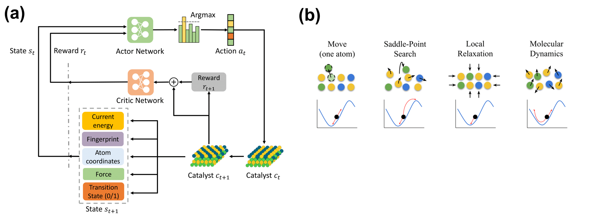
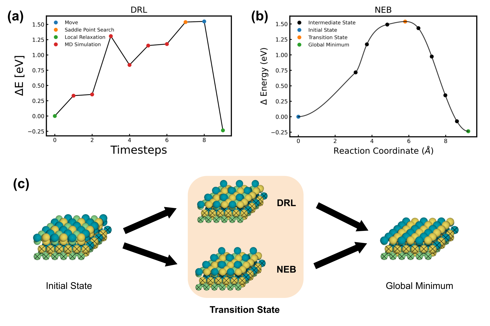

<!-- # surface-seg
Surface segregation using Deep Reinforcement Learning

# installation instructions
* Sella's installation requires numpy in setup.py, so you have to install that first. 
    * 'pip install numpy'
    * `pip install git+https://github.com/ulissigroup/sella.git`
        * Sella has a few unnecessary debugging print statements that are helpful to hand-comment out. This is just a fork to clean those up
* amptorch is also required
    * `pip install git+https://github.com/ulissigroup/amptorch.git`
     * simplenn is also required for amptorch fingerprinting. simpleNN has conflicting tensorflow requirements, but we just need the fingerprint part
         * `pip install cffi pyyaml tqdm braceexpand`
         * `pip install --no-deps git+https://github.com/MDIL-SNU/SIMPLE-NN.git`
* After installing numpy and amptorch, you can install this package
    * `python setup.py develop` from the cloned github repo should work.

# Notes for nersc intallation
* the same conda installation won't work for CPU and GPU and nodes. Something about ASAP3 calculator 
* ffmpeg from conda has a problem when running in parallel. Best to use `module load ffmpeg`

# Docker notes
* clone this repo to a folder
* cd to that folder
* start a jupyter server on port 8888 with
  * `docker run --rm -p 8888:8888 --gpus all -e JUPYTER_ENABLE_LAB=yes -e MKL_NUM_THREADS=1 -e OMP_NUM_THREADS=1 -e NUMEXPR_NUM_THREADS=1 -e MKL_DEBUG_CPU_TYPE=5 -v "$PWD":/home/jovyan/surface_seg ulissigroup/surface_seg`
  * most of the threads seem to come from ASAP3 which is only a tiny fraction of the computation time. It's best to disable the threads and just run more parallel instances.
  * Password for JupyterLab is `asdf`

* if you need to rebuild the image, go to the docker folder and `docker build . -t surface_seg` -->

# Reinforcement Learning for Identifying Metastable Catalysts

[**Deep reinforcement learning for predicting kinetic pathways to surface reconstruction in a ternary alloy**](https://iopscience.iop.org/article/10.1088/2632-2153/ac191c) </br>
Junwoong Yoon*, Zhonglin Cao*, Rajesh Raju*, Yuyang Wang, Robert Burnley, Andrew J. Gellman, Amir Barati Farimani<sup>+</sup>, Zachary W. Ulissi<sup>+</sup> </br>
(*equal contribution, <sup>+</sup>corresponding authors) <br/>
Carnegie Mellon University

[[PDF]](https://iopscience.iop.org/article/10.1088/2632-2153/ac191c/pdf) 
<!-- [[arXiv]]() [[PDF]]() -->



If you find this work useful in your research, please cite:

    @article{yoon2021deep,
        title={Deep reinforcement learning for predicting kinetic pathways to surface reconstruction in a ternary alloy},
        author={Yoon, Junwoong and Cao, Zhonglin and Raju, Rajesh and Wang, Yuyang and Burnley, Robert and Gellman, Andrew J and Farimani, Amir Barati and Ulissi, Zachary W},
        journal={Machine Learning: Science and Technology},
        year={2021},
        publisher={IOP Publishing}
    }

## Installation

### Custom Installation
1. Clone the github repo
```
$ git clone https://github.com/ulissigroup/catgym
$ cd catgym
$ conda env create --name catgym
$ conda activate catgym
$ conda install -c anaconda pip
```

2. Install Sella
```
$ pip install numpy
$ pip install git+https://github.com/ulissigroup/sella.git
```

3. Install amptorch
```
$ pip install git+https://github.com/ulissigroup/amptorch.git
$ pip install cffi pyyaml tqdm braceexpand
$ pip install --no-deps git+https://github.com/MDIL-SNU/SIMPLE-NN.git
```

4. Install other packages
```
$ python setup.py develop
```

### Docker Installation

```
$ git clone https://github.com/ulissigroup/catgym
$ cd catgym
$ docker run --rm -p 8888:8888 --gpus all -e JUPYTER_ENABLE_LAB=yes -e MKL_NUM_THREADS=1 -e OMP_NUM_THREADS=1 -e NUMEXPR_NUM_THREADS=1 -e MKL_DEBUG_CPU_TYPE=5 -v "$PWD":/home/jovyan/catgym ulissigroup/catgym
```
- Password for JupyterLab is `asdf`
- To rebuild the image
```
$ cd docker
$ docker build . -t catgym
```

### Notes for nersc intallation
- The same conda installation won't work for CPU and GPU and nodes. Something about ASAP3 calculator.
- ffmpeg from conda has a problem when running in parallel. Best to use `module load ffmpeg`.

## Environment

To use the gym-based surface segragation environment, please refer to `surface_seg/envs/catgym_env.py`.

## Training 

To train a DRL agent for finding surface segregation trajectories. Please run the file `examples/notebooks/Train_CatGym.ipynb`.

To evaluate a trained DRL agent. Please run the file `examples/notebooks/Evaluation.ipynb`.

## Results



(a) An example energy pathway to a global minimum developed by DRl method. Each data point represents the relative energy $\Delta E$ of an Ni-Pd-Au configuration generated after taking a certain action at each timestep. (b) A minimum energy pathway, created by NEB, to the same global minimum. (c) Ni(green)-Pd(blue)-Au(gold) configurations of the initial state, transitions states built by DRL method and NEB, and the global minimum.

## Acknowledgement
The information, data, or work presented herein was funded in part by the Advanced Research Projects Agency – Energy (ARPA-E), U.S. Department of Energy, under Award Number DE-AR0001221.